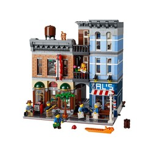
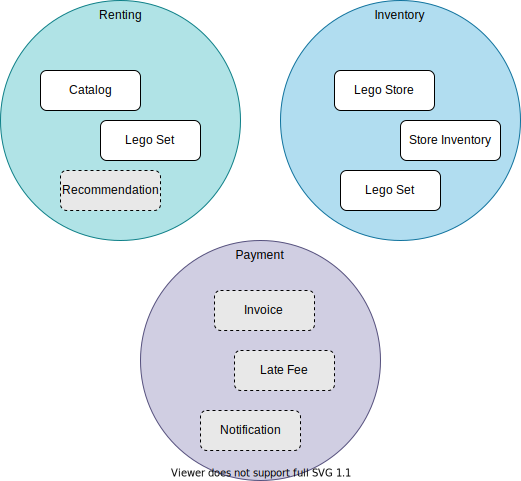
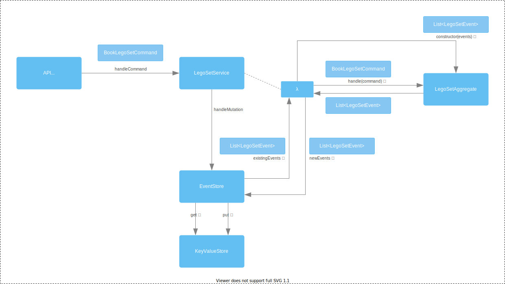

# Event Sourcing with Kotlin

This is a sample app to demonstrate the power of using EventSourced models and the ease with which these can be modelled
using Kotlin.

This code accompanies a talk by Nico Krijnen.

- https://sessionize.com/nico-krijnen/
- https://youtu.be/GFa5hDvaicw

## Sample domain: Renting Lego Sets

To get an idea how renting lego works in real-live, look at sites
like: [www.bricksverhuur.nl](https://www.bricksverhuur.nl)

## Context Map

The [Context Map](https://www.infoq.com/articles/ddd-contextmapping/) below gives an impression of the domains at play
for renting out lego sets and the concepts that play a role in that.

The greyed out blocks are parts that are have been left out of this sample, but could be interesting to explore if you
want to add additional functionality for it.

## EventStorming

Before going into technical details, it is important to understand the domain you are in. You can see part of that in
the section about Event Storming in the recording of the talk accompanying this sample code.

See https://youtu.be/GFa5hDvaicw

## Architecture

Below is a [C4 Container diagram](https://c4model.com/#ContainerDiagram) that gives an impression of the high-level
architecture of the complete application.

At this moment, only the code for the Lego4Hire API server is included in this codebase.

## Application structure

This diagram shows the conceptual flow of commands and events through the components of the application.

